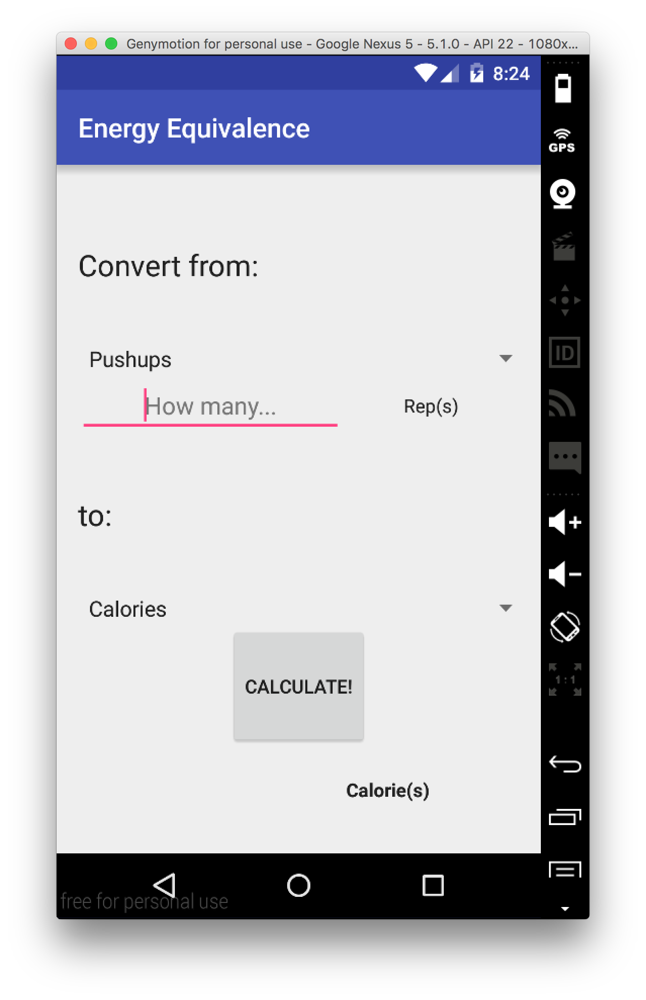

# PROG 01: Crunch Time (Eleanor's Energy Equivalence Engine!)

Convert among exercises with time or reps, calories, and other exercises to
find energy-equivalent exercise options.

This is not medical advice.

## Authors

Eleanor Cawthon (eleanor@eecs.berkeley.edu)

## Demo Video

See [Eleanor's Energy Equivalence Engine](https://youtu.be/ladV2umAVkA) in
action!

## Instructions, with Screenshots

### Step 0: Main Screen
Note the effective use of screen space and the lack of clutter

### Step 1: Choose an Exercise

### Step 2: Quantify Your Workout

### Step 3: Hit Calculate!

### Bonus:
Both the input and the output can be chosen from a drop-down list. Set one to
"Calories" and  the other to an exercise to see how many minutes or repetitions
of that exercise will burn a given number of calories, or to
  see how many calories a particular workout will burn.

You can also find equivalent workouts of different kinds of exercises:

So, according to the tables provided, 100 squats burn the same number of
calories as 4.44 minutes of jumping jacks.

## Acknowledgments

Hat tips to
* Android Studio
* StackOverflow, developer.android.com,
* Workers in the supply chain for the electronics used
* Custodial staff of Soda Hall
